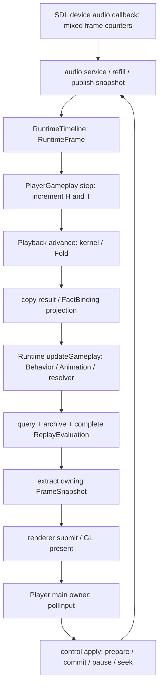

# S7A-7/8 实时架构重审与规划证据

状态：dated architecture review；规划交付，产品整改未实施

证据日期：2026-10-09（Asia/Shanghai）

归属更新（同日后续owner指令）：本报告的审计发现及测量有效范围保留；原S7A-7/8下RT78/DN78
工作归属由[独立Stage RPA](../../../../stage_plans/future/realtime-playback-foundation/plan.md)取代。
原plan-a链接现为交接入口；不将迁移工作计为7/8新增缺口，不将原有设备失败改记通过。
迁移记录与原规划文本归[拆分报告](../handoffs/2026-10-09-realtime-stage-separation.md)。

## 1. 基线、授权与结论范围

审查基线：`stage-7`，HEAD `d33c64b15575a945e50948ad70acb88f05117dce`，接手时 status/diff 为空，
现有 PR #32。用户要求先审查整体架构，再明确共同时间、所有权与发布边界，最后选择线程方案；
随后明确本轮只规划、不实施产品代码。没有重置工作区、修改 master/保护、创建 PR、代发审批或发行。

本报告确认的是调用链、合同冲突与测量边界，不是“卡顿已修复”。旧受限验收及设备失败记录保留；
旧 CI 与旧 Replay=same 不能证明真实音频同步。本轮的决策方向在
[ADR 0046](../../../../adr/0046-realtime-playback-coordination.md)，字段职责在
[宿主边界草案](../../../../api/realtime-host-boundary.md)，未来实施顺序唯一归
[plan-a](../../../../stage_plans/active/stage-07/plan-a.md#3418-实时架构重审与规划2026-10-09)。

评价：保留可嵌入 SDK、单 kernel/Fold、整数判定、事务和恢复边界；必须补齐实际输入/时钟的端到端
语义与运行成本。模块依赖低不等于调度解耦；Stage 6 的表现产品化完成不替代 Stage 7 的实时集成。
不把 Stage 6 描述为首次提供全部动画能力：Stage 4/5 的 Animation/Presentation 基础继续有效。

## 2. 当前实际调用、所有者和阻塞图

图中除 device callback 外均在当前 Player owner 的一轮循环内串行执行；Headless 不创建这些设备。
prepare 是另一条必须同时审查的路径：`PreparedPlayback` 由 Session owner 创建，renderer.prepare
同步借用它读取 manifest/资源，再由 Player 协调音频替换、Session commit 和 renderer activate。

| 边界 | 实际代码入口 | 观察 |
| --- | --- | --- |
| 输入与循环 | [player_control.cpp](../../../../../app/player/src/player_control.cpp)、[sdl_window.cpp](../../../../../engine/platform/src/sdl_window.cpp) | poll 位于循环前部；present 或前一轮CPU工作可推迟下一次捕获 |
| 测试时钟与验证 | [player_gameplay.cpp](../../../../../app/player/src/player_gameplay.cpp) `step` | 每个转换+H、无输入帧+H、每帧+T；每step完整Replay |
| 时钟发布与补队列 | [sdl_audio.cpp](../../../../../engine/audio_sdl/src/sdl_audio.cpp) `postmix/service/updatePresentedFrame/publish` | callback计设备帧；service补PCM并发布；published不是每个callback自动刷新 |
| 判定到动画 | [playback_session.cpp](../../../../../engine/playback/src/playback_session.cpp) `advanceGameplay/publishGameplayProjection` | kernel后同步投影和Runtime更新；不是独立纯判定调度入口 |
| 动画与事务 | [runtime_session.cpp](../../../../../engine/runtime/src/runtime_session.cpp) `updateGameplay/updatePrepared` | 复制evaluation候选后运行Behavior、Animation、resolver，再提交；不能在renderer再造一份求值器 |
| 资源准备 | [presentation_renderer.hpp](../../../../../engine/presentation_renderer/include/cuexis/presentation_renderer/presentation_renderer.hpp) `prepare` | 参数为owner-bound PreparedPlayback引用；不是已可跨线程传输的资源包 |
| 状态和历史 | [execution_kernel.cpp](../../../../../engine/judgement/src/execution_kernel.cpp)、[gameplay_internal.hpp](../../../../../engine/playback/src/gameplay_internal.hpp) | journal、RuntimeState以及公开结果存在复制；不能把所有query都称作O(1)共享句柄 |

## 3. 逐项发现、最小反例与责任

| ID | 严重性/证据类别 | 最小反例或代码事实 | 影响与合同归属 |
| --- | --- | --- | --- |
| RA-01 | 阻断，代码确认 | 同样1000ms表现时间，30轮H=150、60轮H=300（hStep=5）；一次poll的转换越多H越快 | 不能认证实际音乐同步；C78-03/11，S7A-7.1/7.4 |
| RA-02 | 阻断，合同冲突 | 100ms发生的键500ms才poll：capture-now与raw backdating产生不同Tick | V2 Spec §3.7.3/ABI必须明确捕获边界；不能直接采用上一轮建议的timestamp→audio→Tick |
| RA-03 | 阻断，合同确认 | 先advance越过finalization再收到旧键，已封存Miss不能被撤回 | execution profile §3.2/3.3仅同admission轨迹等价；交付进度/推进顺序须先设计 |
| RA-04 | 阻断，受限profile | 两个不同subject量化同Tick，整批拒绝；逐键顺延规避改变了时间 | 保留same_tick_collision；普通键盘支持范围要明示，不伪称同帧和弦支持 |
| RA-05 | 阻断，调用链确认 | present阻塞期间没有service/refill，只有设备消耗继续 | 音频服务须独立于绘制；具体欠载时长依buffer/设备，未接受新数值 |
| RA-06 | 阻断，字段/实现确认 | AudioClockSnapshot无相关单调采样时刻；postmix帧减buffer后按rate换算并clamp | 这是估计位置，不是精确硬件游标；源帧/设备帧率/时钟段/误差归音频与宿主合同 |
| RA-07 | 高，代码确认 | 每个step从头评估全部控制/输入历史 | 实时和验收职责混合；移出热路径但保留完整ReplayEvaluation，S7A-7.4/6.5 |
| RA-08 | 高，代码确认 | submit/advance复制ReplayData；每工作Tick复制RuntimeState、Fold候选与faultReserve | 历史增长成本与不可变结果留存须整体审查；不能只宣称分块后所有操作O(1) |
| RA-09 | 高，代码确认 | GameplayAccess::result复制KernelProjection，advance和query均消费 | 公共结果寿命合理，但不必每次深复制全历史；C78-08，不能把“只query分数”当作廉价证据 |
| RA-10 | 阻断，调用链确认 | advanceGameplay→projection→updateGameplay→Animation，同步执行 | 判定worker仍可能被动画阻塞；先设计推进与表现采样边界，C78-03/07 |
| RA-11 | 阻断，owner约束 | worker生成Prepared，主线程renderer.prepare调用它；跨线程move/析构也违规 | 需要owning资源准备边界，不能去掉threadChecker或加锁绕过；C78-02/12 |
| RA-12 | 阻断，事务反例 | renderer预检后worker继续advance使generation变化，音频先激活后Session commit stale | 多owner事务须有提交fence、回执和取消协议；设备不可逆故障不能假称全回滚 |
| RA-13 | 高，发布反例 | Seek后旧frame延迟到达，资源ID相同但代数不同；或只取最新Fact漏掉group成员 | 完整frame可合并，Fact/控制不可丢；projection scope与资源/时钟generation独立，C78-04/07 |
| RA-14 | 高，寿命合同 | 调度解耦后把RemainingFrames从Runtime更新改为GPU呈现次数 | 改变既有表现语义；typed lifetime与旧frame lifetime各自保持，显式恢复替换游标 |
| RA-15 | 高，错误边界 | Fold失败后音频继续走，renderer自行按音频推演新画面 | faulted只读query不能更新画面；新调度必须服从原失败发布边界 |
| RA-16 | 待设备证据 | SDL主线程poll在present/窗口拖动期间延迟；event watch不能证明OS原始发生时刻 | 独立音频线程不等于输入独立；主线程阻塞后的公平判定仍须输入来源/迟到合同证明 |

当前欠载检测重置source段计算基线和underrun计数，但该路径没有增加discontinuityId。
“欠载即新generation并冻结Gameplay”是候选策略，不是现有行为；需要区分暂时缺数据、正常音轨末尾
和设备丢失。Play/Pause/Seek、输出延迟校正与Chart offset不能各自重复补偿。

## 4. 平台与依赖证据

本地candidate/debug依赖中的SDL版本头为3.4.12。`SDL_events.h` 的PollEvent、`SDL_video.h` 的
GL_MakeCurrent和GL_SwapWindow标注主线程调用；`SDL_audio.h` 明示postmix在无数据时仍可输出静音并回调。
只保留所需声明上下文和文件哈希于证据包，不把upstream API保证扩大为硬件实际精度。

因此“主线程输入、任意worker执行SDL GL”不作为当前跨平台默认方案；把主线程留给事件/GL、把
Playback移到worker又遇到RA-11/12，需先解开资源准备和控制事务。SDK继续单owner，不安装内部
Kernel/Recovery图，不把线程实现写进Chart或判定identity。

## 5. 基线测量与未执行项

在用户收紧为仅规划之前启动了隔离测量探针；探针仅链接当前构建产物，未修改产品源码或替换Player。
探针及运行脚本保留在本报告证据包中，不加入生产target/测试矩阵。它调用生产公共入口做表征，
**不是独立oracle**，也不能证明新时钟或新线程方案有效。

测量设计：固定同一小型public fixture、零输入，分别运行当前Player每步Replay、公共advance/query
仅末尾Replay、GameplayOnly仅末尾Replay；每种脚本都在表现域覆盖1000ms，步数为30/60/256/1024，
预热16步，计划3次重复。相同次数时H/T脚本相同；不同次数只用于暴露计帧桥，不能当成相同admission
控制轨迹的判定等价测试。每次运行取得自身归档的完整ReplayEvaluation，确认evidenceValid，
并用sameResult比较其result与该运行实时query结果；未逐字段比较评估器其他元数据，
也未执行不同模式、不同步数之间的完整结果互比。

MSVC Debug candidate ON、STATIC，预热后3次重复的中位数如下；单位为毫秒，总耗时不是单帧耗时。
每行只有一个Fact且无真实输入，体现控制历史增长，不代表大谱面吞吐或最高帧率。

| 步数 | 当前Player每步Replay：推进总耗时 | 公共Presentation：推进总耗时 | 公共GameplayOnly：推进总耗时 |
| --- | --- | --- | --- |
| 30 | 58.5301 | 6.6595 | 3.3952 |
| 60 | 201.964 | 14.4538 | 7.749 |
| 256 | 5447.37 | 90.8948 | 61.4306 |
| 1024 | 238007 | 812.433 | 695.925 |

1024步公共Presentation的末尾完整Replay中位另需667.635ms，GameplayOnly另需676.191ms；
不把末尾验证从总成本中隐去。所有39个输出行（含3个预热行）均完成各自实时结果与末尾完整Replay
结果比较，complete_same=1；没有执行不同模式之间的完整结果互比，不把这个探针称作独立oracle。
30步和60步表现终点同为1000ms，实际H分别150/300，直接表征当前计帧桥。
该Debug差异支持优先移出热路径重复验证，不构成Release性能承诺或“无需判定worker”的证明。

基线构建/测试：Debug candidate和Release candidate均增量构建对应现有PlayerControl/Playback target，
各自PlayerControl为34 cases/739 assertions通过，fixture setup为1 case/22 assertions通过。
Release测量runner查找compile_commands中的player_gameplay_tests.cpp条目时StopIteration，
复核确认该数据库缺少此条目（并非已证实的路径分隔符问题）；**没有生成Release测量值**；
保留成功的既有测试与失败记录，不把它称为Release探针通过。本轮未改工具实现重跑。

原始证据：[本轮证据包](2026-10-09-realtime-architecture-review-evidence.zip)，包括probe source、
原始CSV、逐命令cwd/退出码、fixture哈希、基线HEAD、平台头约束定位、检查输出和证据文件哈希。
本地原件在`out/realtime-architecture-audit/`；最初位于tools/research的两份临时探针已移到
`out/realtime-architecture-audit/probe-source/`，不加入代码交付。原manifest保留实际执行时路径；
证据包README说明原路径与归档对应关系。数值只属于此fixture/构建/机器，不接受生产阈值。

本次未执行：新线程原型、真实设备时钟精度/欠载/100ms与500ms卡顿实验、独立时间oracle、
大规模长历史内存分析、MinGW/Linux/shared的重构验证、S7A-9最终矩阵及owner接受。
旧10ms→173ms描述没有在本轮相同fixture下重测，不作为本报告测量结论。

## 6. 独立审查

按code-quality的Requesting Review流程对关键代码和规划做独立只读复核。复核确认RA-02/03/10/11/12
为线程方案冻结前的阻断，补充公开结果深复制和欠载不递增discontinuity的事实。
已把“任意卡顿结果不变”改为在明确input/admission/control前提下的等价验证；没有将源码阅读
称为设备测试，也没有将推荐线程数、分块日志或无锁队列登记为已接受实现。

## 7. 规划交付边界

本轮只增加/修订文档、保留审查证据。S7A-7/8的实际设备实时整改保持未实施；S7A-8.4未退出。
S7A-9只接收本报告测量输入，不接受阈值，不开展最终关闭；不进入S7B+/S7C实施或Stage8发行。

文档交付检查（仅检查本轮文档及既有版本一致性）：

| 命令 | 结果 |
| --- | --- |
| `python -B tools/check_docs.py` | 397 Markdown / 20 candidate JSON/CXT通过 |
| `python -B tools/check_docs_status_contract_tests.py` | 4/4通过 |
| `python -B tools/check_docs_section_contract_tests.py` | 5/5通过 |
| `python -B tools/check_docs_target_contract_tests.py` | 2/2通过 |
| `python -B tools/update_version.py --check` | 26.10.09-2一致；只读检查，版本未更改 |
| `git diff --check` | 通过 |

原始输出与命令登记在证据包的checks目录；不代表产品重构或跨平台验收通过。
